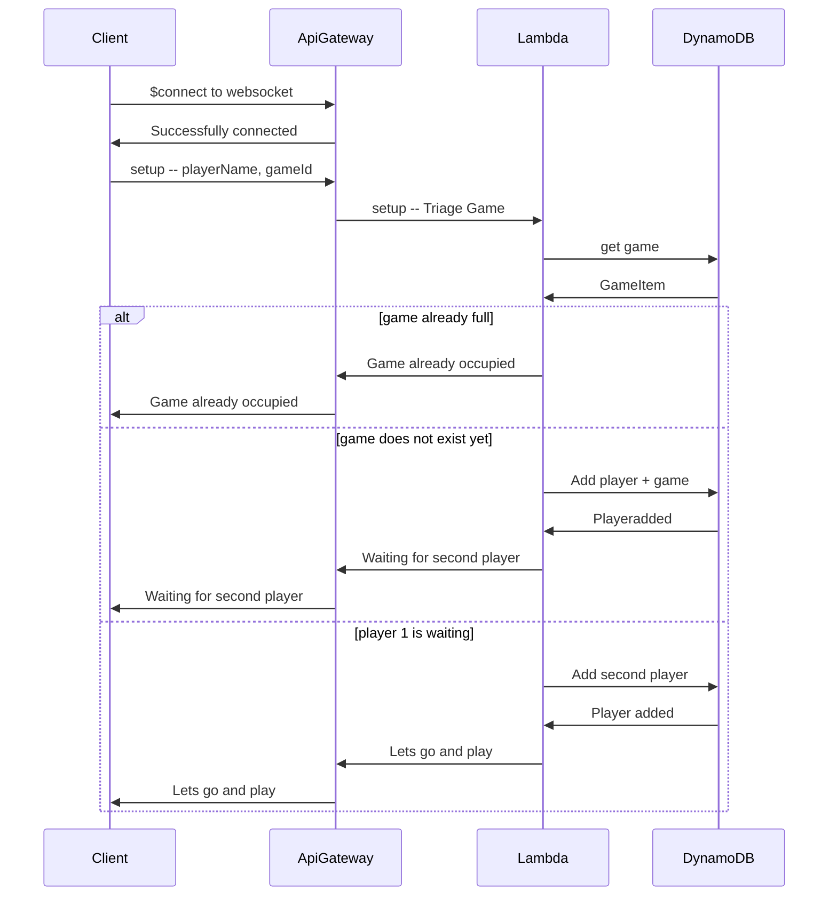

# tictacgo

This is a serverless implementation of TicTacGo. It's techstack is: 
- AWS 
- Pulumi for IaC
- AWS Lambda: Serverless functions in Go (Lambda)
- AWS API Gateway: Exposing the websocket Api
- DynamoDB for storing the data of the set
- SAM for local testing of lambda functions

## Overall architecture



## Install 

1. Create the Lambda Go binaries
```sh 
make build
```
2. Install the whole thing to your AWS Account, just run the pulumi IaC stack: 
```sh
pulumi up 
```

## Development of lambda functions

To develop the lambda functions locally, we rely on [AWS SAM](https://docs.aws.amazon.com/serverless-application-model/latest/developerguide/what-is-sam.html)
Imagine, developing the setup lambda function: 
```sh
cd handler
sam build
sam local invoke setup -e events/setup-event.json
```
For this you have to have the ```template.yaml``` set up fitting the lambda functions you have created until now.


